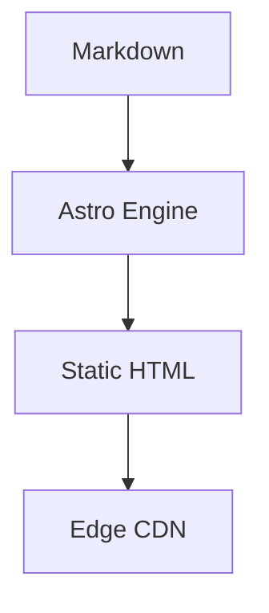

# Technical Formatters

Astrodex extends standard Markdown with several specialized formatters to provide a premium technical reading experience.

## 1. Admonitions (Callouts)

Highlight critical information using semantic notice blocks.

> **Note:** Supplemental information or helpful tips.

> **Warning:** Cautionary advice to prevent configuration errors.

> **Danger:** Critical alerts regarding breaking changes or security risks.

**Syntax:**
```markdown
> Note: Your message here.
```

## 2. Mermaid Architecture

Visualize systems and workflows directly in your docs using Mermaid.js syntax.



**Syntax:**
Use the `mermaid` language tag in a standard code block.

## 3. Premium Code Blocks

The engine utilizes **Shiki** for syntax highlighting, providing IDE-grade coloring for over 100 languages.
- **Copy to Clipboard:** Every code block features a persistent copy button.
- **Trailing Slash Support:** Optimized for clean URL structures.

## 4. Intelligent Image Handling

- **Automatic Optimization:** Images are processed via `astro:assets` for WebP conversion and lazy loading.
- **Lightbox Zoom:** Powered by `medium-zoom`, any image in the prose can be clicked to enter a focused lightbox view.

---

> **Did you know?** Astrodex supports **MDX**, allowing you to import interactive Astro components directly into your documentation files.
