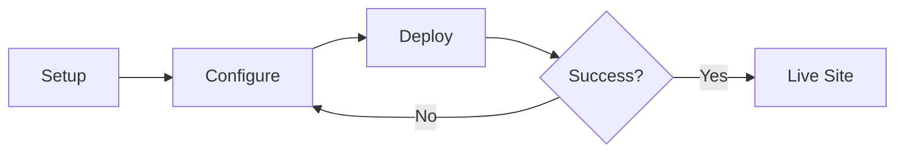

# Interactive Components

Astrodex enhances standard Markdown with several built-in formatters and components to make your documentation more professional and visually engaging.

## 1. Admonitions (Callouts)

Highlight important information using our custom notice blocks.

> **Note:** Helpful tips or supplemental information.

> **Warning:** Cautionary advice to prevent minor issues.

> **Danger:** Critical warnings regarding data loss or security.

### Syntax:
Simply start a line with the keyword in a blockquote:
```markdown
> Note: Your message.
> Warning: Your warning.
> Danger: Your alert.
```

## 2. Mermaid Diagrams

Visualize architecture, state machines, or sequences natively.



### Syntax:
Use the `mermaid` language tag in a code block.

## 3. Premium Code Blocks

Our code engine includes:
- **Shiki Highlighting:** Professional-grade syntax coloring.
- **Copy Button:** One-click clipboard copy on all snippets.
- **Title Support:** (Optional) Add filenames to your blocks.

## 4. Image Lightbox

All images in your documentation are automatically enhanced:
- **Medium Zoom:** Click any image to expand it into a focused lightbox.
- **Optimized Assets:** Powered by `astro:assets` for maximum performance.

---

> **Did you know?** Astrodex supports **MDX**. This means you can import and use any Astro component directly inside your `.mdx` articles!